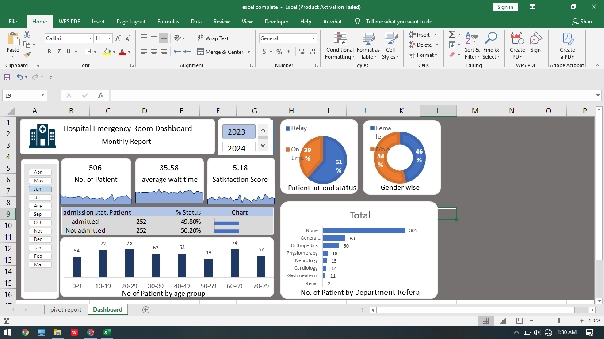

📊 Hospital Emergency Room Dashboard (Excel Project)
📌 Project Overview

This project is an interactive Excel dashboard created to analyze Hospital Emergency Room performance and patient trends. The dashboard helps track important KPIs such as patient count, wait time, satisfaction score, admission status, and department-wise analysis.

The project was built using Microsoft Excel with Pivot Tables, Pivot Charts, Slicers, and Dashboard Design techniques.

🎯 Objectives

-Analyze patient visit trends
-Monitor average patient wait time
-Track patient satisfaction score
-Compare admitted vs non-admitted patients
-Understand department-wise patient distribution
-Create an interactive dashboard for quick insights

🛠️ Tools & Features Used

-Microsoft Excel
-Pivot Tables
-Pivot Charts
-Slicers
-Conditional Formatting
-Dashboard Design
-Data Cleaning
-KPI Cards

📈 Dashboard Insights

Some key insights generated from the dashboard:

-Daily patient trends analysis
-Average patient wait time monitoring
-Patient satisfaction score tracking
-Department-wise patient distribution
-Admission status analysis
-Overall emergency room performance overview

📂 Files Included
excel complete.xlsb → Main Excel dashboard project file

🖼️ Dashboard Preview

💡 Skills Demonstrated

-Data Analysis
-Data Visualization
-Dashboard Creation
-Excel Reporting
-Business Insights Generation
-Interactive Dashboard Design

📚 Learning Outcome

This project helped improve my understanding of:

-Excel dashboard development
-Data storytelling
-KPI analysis
-Pivot Table reporting
-Business data visualization

dashboard.png → Dashboard screenshot preview
🖼️ Dashboard Preview
